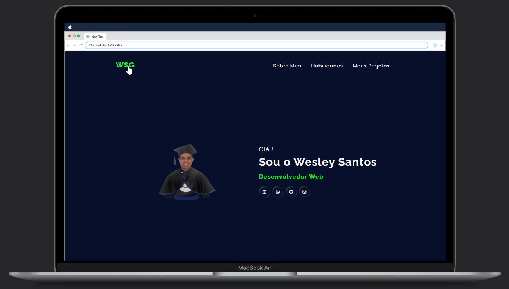

# Meu 1º Portfólio 

Este é o meu primeiro portfóllio !

  
    <h2 style="color: #00ff08">Prévia</h2>

## Tecnologias utilizadas:

- HTML5
- CSS3

## Responsividade

O portfólio foi projetado para ser responsivo, ou seja, ele se adapta aos diferentes tamanhos de tela.

<figure>

</figure>

## Conclusão

Projeto em 1ª fase concluído, criado para testar minhas habilidades e será aprimorado conforme meus conhecimentos forem sendo aprimorados com novas tecnologias,. 

Quero agradeçer também a toda equipe do DevQuest Dev em Dobro pelas instruções nessa minha jornada pela transição de carreira para a programação !